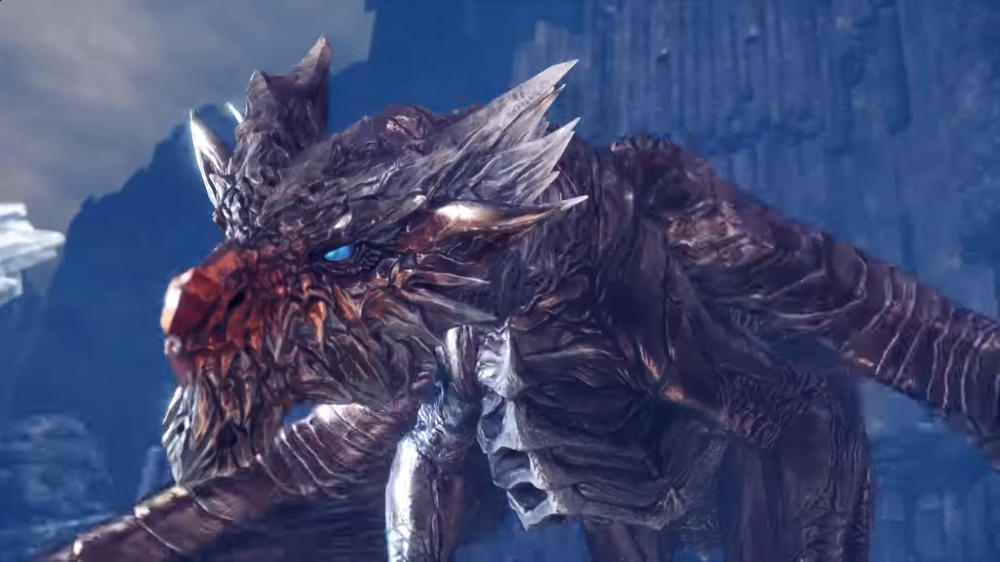

# **Kushala Daora,**
Date: February 11th, 2020  
Category: Elder Dragons

Kushala Daora is an Elder Dragon in Monster Hunter World (MHW). クシャルダオラ (鋼龍) in Japanese.
    
**Found in**: Found in:  Ancient Forest, Elder's Recess         
**Target of Quests**: 
Kushala Daora   
Dragon of Steel         
A Portent of Disaster   
The Winds of Wrath Bite Deep    
The Eye of the Storm       
**Species** : Elder Dragons  
**Elements** : None  
**Resistances** :       
Water   
Ice     
**Weaknesses** :           
Thunder(3)      
Dragon(2)       
